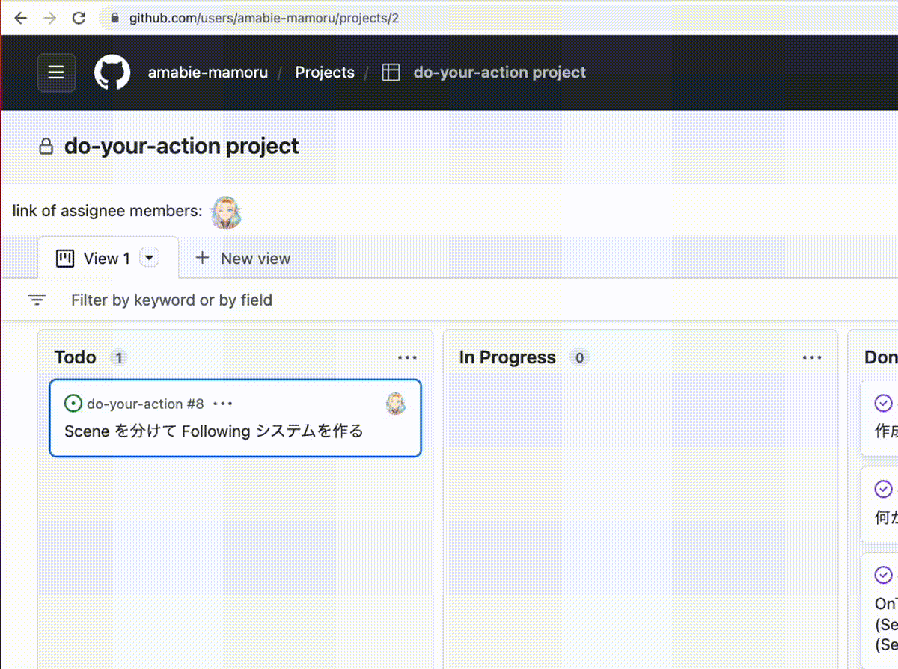

# 天日江護が使ってる自作 Chrome Extension

## Github Project で Assignee をアイコン 1 Click で絞り込める機能

### 課題

複数人でプロジェクトを回してた時に他人のタスクを確認するのが面倒だった

### 機能効果

検索ボックスからクエリ書いたりアイコン選択しなくてもアイコンクリックだけで絞り込める機能

アイコンを探したり検索クエリを書く手間をなくす

また、アイコンが似てる人向けに a タグの title 属性を使って長時間マウスオーバーすると名前が出るようにした
