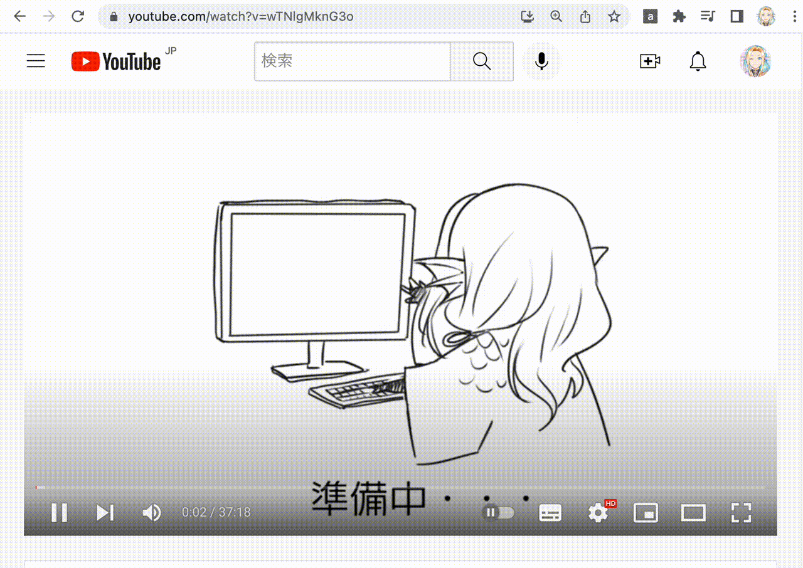

# 天日江護が使ってる自作 Chrome Extension

## Youtube 見過ぎを自分で抑止したい人用の機能 (observe\_youtube\_watch.js)

### 課題

なんやかんやで言い訳して Youtube をだらだら見ている自分を叱りたかったので作った

### 機能効果

* `observe_youtube_watch.js` の上の方に書いてある設定値によって一定時間以上 Chrome で Youtube を見てたら抑止のダイアログが出る
* スヌーズしたら設定値だけ延長する（必要な動画見てるときもあるだろうから）
* 閉じる覚悟を決めたらもう一度ダイアログでアラートはするが強制終了することはしない（あくまで自制したい人向け）
* 他のタブで見たとしても時間を共有するので抜け道を防止できる
* 設定時間にきたらリセットするのでリセット時間に合わせて 1日n時間まで！みたいな制限ができる

## Github Project で Assignee をアイコン 1 Click で絞り込める機能(github\_project\_assignee\_list.js)

### 課題

複数人でプロジェクトを回してた時に他人のタスクを確認するのが面倒だった

### 機能効果

検索ボックスからクエリ書いたりアイコン選択しなくてもアイコンクリックだけで絞り込める機能

アイコンを探したり検索クエリを書く手間をなくす

また、アイコンが似てる人向けに a タグの title 属性を使って長時間マウスオーバーすると名前が出るようにした

## 完全自制したいときの機能(forbidden\_site.js)

### 課題

observe\_youtube\_watch.js 程度では自制できないタイミングにきた

### 機能効果

alert を使って擬似的にサイト内を操作できない(かろうじてできてもめちゃくちゃ不便にする)

